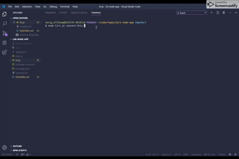

# liri-node-app

## Description: 
 It's not SIRI, its LIRI!!  LIRI will accept requests for songs, concerts, and movies, and return key pieces of information.  LIRI will be a command line node app that takes in parameters and gives you back key data-points.

---

## Technologies used:
  - Node.js
  - Javascript

## NPM packages:
  - "axios": "^0.19.0",
  - "dotenv": "^8.1.0",
  - "moment": "^2.24.0",
  - "node-spotify-api": "^1.1.1"

## Commands:
  LIRI accepts the following commands: `<movie-this>`, `<spotify-this-song>`, `<concert-this>`, and `<do-what-it-says>`.
  You will need to type the command followed by a search keyword. 

### The `<concert-this>` command will return these values: 
  - Name of Venue
  - Location of Venue
  - Time of Event

### The `<spotify-this-song>` command will return these value:
  - Artist(s)
  - The song's name
  - A preview link of the song from Spotify
  - The album that the song is from
    
  
 ### The `<movie-this>` command will return these values: 
  - Title of the movie
  - Year the movie came out
  - IMDB Rating of the movie
  - Rotten Tomatoes Rating
  - Country where the movie was produced
  - Language of the movie
  - Plot of the movie
  - Actors in the movie   
    
    **If no movie is typed in it will return the values from the movie "Mr. Nobody."
  
  ### The `<do-what-this-says>` command will return the value of the input from the random.txt file
  
  
  Author:
  
  Dan L. Grigg
